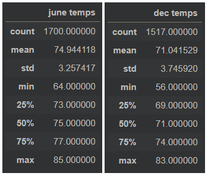
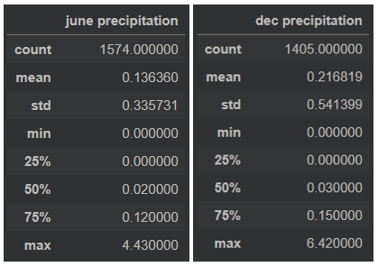

# Surfs Up!

## Overview
While on vacation in Hawaii last year, I discovered a newfound passion for surfing and have been trying to come up with a plan to return to Hawaii and live there forever. Finally, thinking that starting a Surf n’ Shake Shop could be a foolproof idea. For this to work out successfully, I needed to get some investor backing. I contacted W. Avy, an investor who is famous for his love of surfing. I provided W. Avy and the board of directors a preliminary analysis of precipitation levels in Oahu- where the shop would be located, to address their initial concerns. In this analysis, we will be finding the key differences in weather between June and December and discussing recommendations for further analysis.

## Results

June vs December Temperature Statistics.

- On average, June is about 4°F warmer than December. The average temperature in June is 75°F, while the average temperature in December is 71°F.
-	The minimum temperature observed between June and December has a difference of 8°F. June had a minimum of 64°F and December had a minimum of 56°F.
-	June and December only had a 2°F difference in maximum temperature, with 85°F and 83°F, respectively.
-	The standard deviations for June and December are 3.257 and 3.746, respectively. Assuming a normal distribution, this means that temperatures for June would not normally go below 71.69°F and would not go above 78.20°F and temperatures for December would not normally go below 67.30°F and would no go above 74.79°F.

## Summary
Another factor that could affect sales is rain. I have conducted further analysis on the precipitation levels in June and December. Below are my findings:

June vs December Precipitation Statistics.

-	On average, June experiences 0.08 inches of rain less than December. The average rain in June is 0.14 inches, while the average rain in December is 0.22 inches.
-	Quartile 1 and the minimum rain experienced in June and December were all zero, meaning there were at least 25% of the days in June and December that did not rain at all.
-	With a 1.99 difference, June had a maximum rain of 4.43 inches and December had a maximum rain of 6.42 inches.
-	The standard deviations for June and December are 0.336 and 0.541, respectively. Assuming a normal distribution, this means that rain for June would not normally go above 0.48 inches and rain for December would not normally go above 0.76 inches.

To summarise, Oahu is a good place to set up the Surf n’ Shake Shop because even during rainier months like December, less than 0.25 inches of rain/day is experienced. The weather there stays relatively consistent throughout the year, with only about a 4°F difference between one of the hottest (June) months and coldest (December) months. On average, Oahu has ideal temperatures in the 70°Fs which makes it great weather for surfing and ice cream year round.

